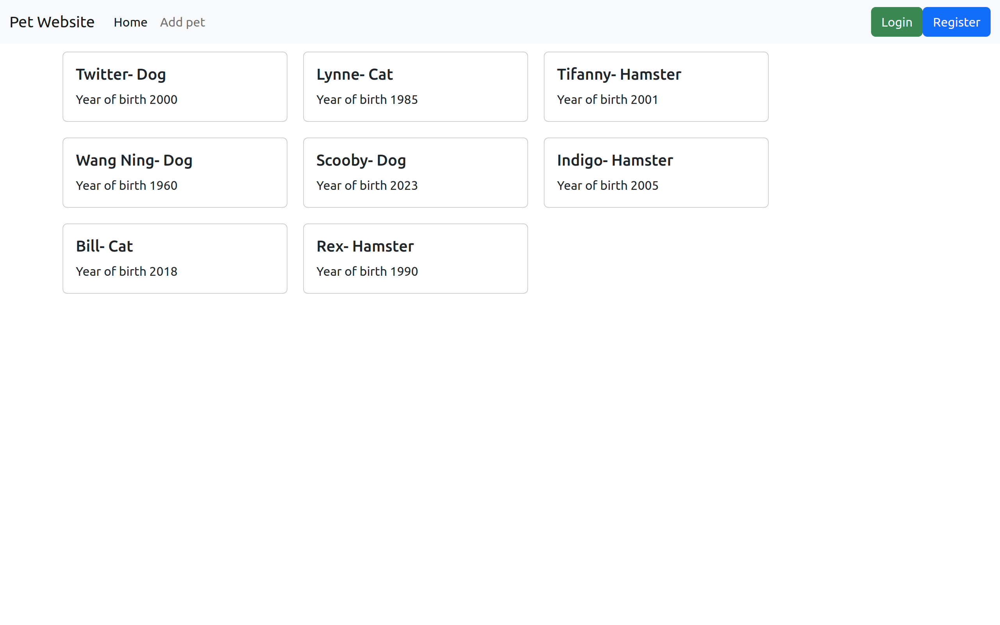

# Django Pet website.

This is a project about Pets, a user is required to create an account then they can create and view all the pets, know the pet species and the date of birth.

### Cloning the repository

--> Clone the repository using the command below :
```bash
git clone https://github.com/WayneMusungu/PetWebsite.git

```

--> Move into the directory where we have the project files :
```bash
cd PetWebsite

```

--> Create a virtual environment :
```bash
# Create our virtual environment
python -m venv venv

```

--> Activate the virtual environment : <br><br>
windows
```bash
venv\scripts\activate

```
linux
```bash
source venv/bin/activate

```

--> Install the requirements :
```bash
pip install -r requirements.txt

```

--> Migrate Database
```bash
python manage.py migrate

```

--> Create Super User
```bash
python manage.py createsuperuser

```

#

### Running the App

--> To run the App, we use :
```bash
python manage.py runserver

```

> ⚠ Then, the development server will be started at http://127.0.0.1:8000/

### Screenshot
This is the home page

